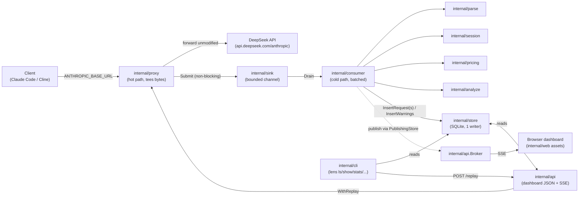

[← INDEX](INDEX.md)

# Architecture

## System purpose

deepseek-lens (`lens`) is a local observability proxy for DeepSeek API traffic. It sits between an
Anthropic-shaped client (Claude Code, Cline, etc.) and DeepSeek's Anthropic-compatible endpoint,
streams every request/response through unmodified, and records what was sent, what came back, what
it cost, and which Anthropic-only request parameters DeepSeek silently ignored
([README.md](../../README.md)). It is a single-user, loopback-only developer tool — one Go binary,
one SQLite file, no hosted deployment, no multi-user auth
([CLAUDE.md](../../CLAUDE.md)).

## Tech stack

| Layer | Choice | Version | Evidence |
|---|---|---|---|
| Language | Go | 1.24 (toolchain 1.24.1) | [go.mod](../../go.mod) |
| HTTP | Go stdlib `net/http` + `httputil.ReverseProxy` | stdlib | [internal/proxy/proxy.go](../../internal/proxy/proxy.go) |
| Storage | SQLite via `modernc.org/sqlite` (pure Go, no cgo) | v1.46.0 | [go.mod](../../go.mod), [internal/store/store.go](../../internal/store/store.go) |
| Dashboard frontend | Vanilla embedded HTML/CSS/JS (no framework, no `package.json`) | — | [internal/web/](../../internal/web/) |
| Live updates | Server-Sent Events (SSE) via a hand-rolled broker | — | [internal/api/broker.go](../../internal/api/broker.go) |
| CLI | Hand-rolled subcommand dispatch table + stdlib `flag` | — | [cmd/lens/main.go](../../cmd/lens/main.go) |

> ⚠️ ASSUMPTION: no dependency-injection framework, ORM, or web framework is used anywhere — every
> package wires its own narrow interfaces by hand (see [conventions.md](conventions.md)). Confirmed
> by [go.mod](../../go.mod) listing only SQLite and its transitive support libraries as direct/indirect deps.

## Components

One process, `cmd/lens`, dispatches to the 13 `internal/` packages in the table below. `lens serve`
([internal/cli/serve.go](../../internal/cli/serve.go)) is the only command that wires them all
together at once; every other CLI command opens the store or dashboard API on its own.

| Package | Responsibility | Evidence |
|---|---|---|
| `internal/config` | Loads `Config` from flags > env (`LENS_*`) > `~/.deepseek-lens/config.toml` > defaults; validates loopback binding | [internal/config/config.go](../../internal/config/config.go) |
| `internal/proxy` | The hot path: transparent streaming reverse proxy to DeepSeek, tees request/response bytes into the sink, redacts sensitive headers, never buffers | [internal/proxy/proxy.go](../../internal/proxy/proxy.go) |
| `internal/sink` | Bounded, non-blocking channel handoff between the proxy (producer) and consumer (consumer); drops under load rather than delaying the client | [internal/sink/sink.go](../../internal/sink/sink.go) |
| `internal/parse` | Pure functions: extracts `Meta` (request shape) and `Usage` (token/response shape) from captured bytes, including incremental SSE parsing | [internal/parse/meta.go](../../internal/parse/meta.go), [internal/parse/sse.go](../../internal/parse/sse.go) |
| `internal/pricing` | Loads/saves the `~/.deepseek-lens/prices.toml` rate table (hand-rolled flat format, not real TOML) and computes per-call cost | [internal/pricing/pricing.go](../../internal/pricing/pricing.go), [internal/pricing/table.go](../../internal/pricing/table.go) |
| `internal/session` | Groups calls into agentic "runs" by explicit header or prompt-prefix-hash + inactivity gap; both the pre-insert resolver and the post-insert aggregator | [internal/session/session.go](../../internal/session/session.go) |
| `internal/analyze` | Rule engine that emits `store.Warning`s — mostly DeepSeek's silent parameter drops/rewrites, plus at least one plain billing fact (a call priced at DeepSeek's 2x peak rate) that isn't a divergence at all | [internal/analyze/rules.go](../../internal/analyze/rules.go), [internal/analyze/kinds.go](../../internal/analyze/kinds.go) |
| `internal/consumer` | The cold-path pipeline: drains the sink, runs parse → session → cost → insert (batched) → analyzers → session fold, with full per-call error containment | [internal/consumer/consumer.go](../../internal/consumer/consumer.go) |
| `internal/store` | SQLite persistence: one writer connection (`SetMaxOpenConns(1)`), up to 4 reader connections, WAL mode | [internal/store/store.go](../../internal/store/store.go), [internal/store/schema.sql](../../internal/store/schema.sql) |
| `internal/replay` | Pure helpers for `lens replay`: JSON-path body edits, outcome diffing | [internal/replay/edit.go](../../internal/replay/edit.go), [internal/replay/replay.go](../../internal/replay/replay.go) |
| `internal/api` | Dashboard's read-only JSON API + SSE broker + the one write route (`POST /api/requests/{id}/replay`) + embedded static asset mount | [internal/api/api.go](../../internal/api/api.go), [internal/api/broker.go](../../internal/api/broker.go) |
| `internal/web` | `go:embed`-ed dashboard assets (`index.html`, `app.js`, `style.css`) | [internal/web/embed.go](../../internal/web/embed.go) |
| `internal/cli` | Twelve subcommand implementations (`doctor`, `serve`, `ls`, `show`, `tail`, `stats`, `sessions`, `warnings`, `export`, `prices`, `replay`, `purge`) | [internal/cli/](../../internal/cli/) |

## Cross-cutting concerns

- **Auth**: none. The proxy and dashboard bind loopback-only by default
  (`config.Validate`'s `validateLoopback`); `--allow-remote` is required to bind elsewhere. The one
  state-changing route, replay, adds its own Origin/Host allowlist instead of a credential — see
  [security-and-permissions.md](security-and-permissions.md).
- **Logging**: stdlib `log` package only, to stderr (`log.Printf` throughout
  [internal/consumer/consumer.go](../../internal/consumer/consumer.go) and
  [internal/cli/serve.go](../../internal/cli/serve.go)). No structured logging library.
- **Error handling**: "fail open" is the project-wide rule (stated in
  [CLAUDE.md](../../CLAUDE.md)) — a broken observer must never break the user's coding session.
  Every stage of the consumer pipeline recovers its own panics and logs+counts rather than
  propagating (see [workflows.md](workflows.md)).
- **Config/env**: `internal/config.Load` resolves `flags > LENS_* env vars > ~/.deepseek-lens/config.toml
  > built-in defaults` ([internal/config/config.go:233-264](../../internal/config/config.go)).
- **No multi-tenancy / no regions**: single user, single local SQLite file, single process.

## Component diagram

## External integrations

| Integration | Purpose | Config | Evidence |
|---|---|---|---|
| DeepSeek Anthropic-compatible API | The proxied upstream | `UpstreamURL` (default `https://api.deepseek.com/anthropic`), `LENS_UPSTREAM_URL`, `--upstream-url` | [internal/config/config.go](../../internal/config/config.go) |
| SQLite (embedded, `modernc.org/sqlite`) | Sole persistence layer; no external DB server | `DBPath` (default `~/.deepseek-lens/lens.db`), `LENS_DB_PATH`, `--db-path` | [internal/store/store.go](../../internal/store/store.go) |

No queues, caches, object stores, or third-party SaaS integrations exist in this codebase.
