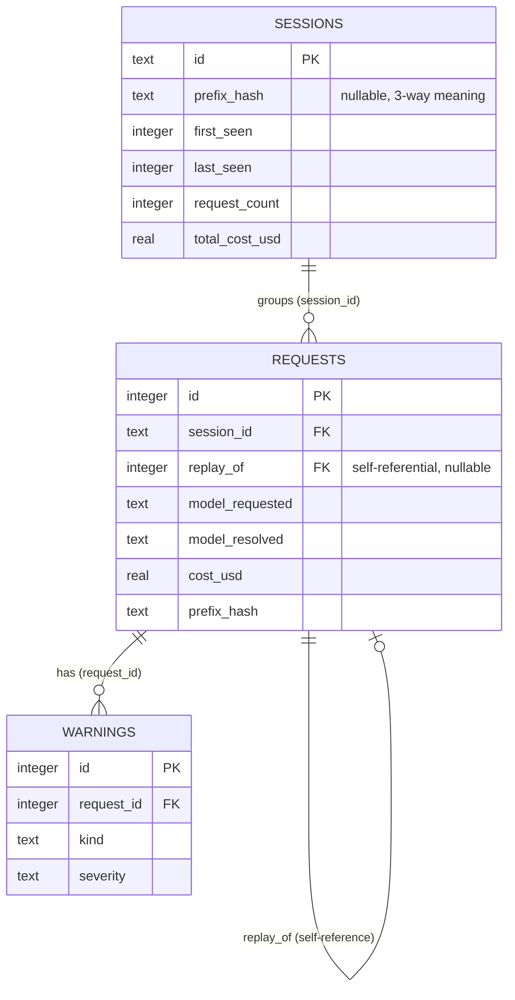

[← INDEX](INDEX.md)

# Data Model

Single SQLite database (default `~/.deepseek-lens/lens.db`), schema applied with
`CREATE TABLE IF NOT EXISTS` only — **no migration framework in v1**
([internal/store/schema.sql:1-5](../../internal/store/schema.sql)). Every column any planned
feature will ever need already exists in the schema, even columns only a later feature populates.

## Entity catalogue

| Table | Purpose | Key fields | Constraints/Indexes | Evidence |
|---|---|---|---|---|
| `requests` | One row per proxied (or replayed) call | `id` PK, `started_at`, `method`/`path`/`status`, `req_body`/`resp_body` (BLOB, redacted+capped), `input_tokens`/`output_tokens`, `model_requested`/`model_resolved`, `session_id`, `cost_usd`/`cost_source`, `replay_of`/`replay_edits`, `prefix_hash` | Index on `started_at`, index on `session_id` | [internal/store/schema.sql:10-41](../../internal/store/schema.sql) |
| `sessions` | Agentic-run grouping with incrementally maintained totals | `id` PK (format `s_<unix-ms>_<8hex>`), `prefix_hash` (nullable, see below), `first_seen`/`last_seen`, `request_count`, `total_input_tokens`/`total_output_tokens`/`total_cost_usd`, `priced_count`/`unpriced_count`, `model_set`, `warning_count` | Index on `prefix_hash` | [internal/store/schema.sql:50-65](../../internal/store/schema.sql) |
| `warnings` | One row per analyzer finding attached to a request | `id` PK, `request_id` FK (no enforced FK constraint), `kind`, `severity`, `detail`, `path`, `created_at` | Index on `request_id` | [internal/store/schema.sql:67-77](../../internal/store/schema.sql) |

Go types mirroring these tables live in
[internal/store/types.go](../../internal/store/types.go): `Request`, `Session`, `Warning`, plus
query-only shapes `Filter`, `Summary`, `ModelStat`, `DayStat`, `CostSourceStat`.

Times are stored as Unix **nanoseconds** (`INTEGER`), chosen so a Go `time.Time` round-trips exactly
through `UnixNano()`/`time.Unix(0, ns)`
([internal/store/schema.sql:7-8](../../internal/store/schema.sql)).

## Relationships

## Enums & status lifecycles

No SQL enum types (SQLite has none); these fields are free-form `TEXT` whose valid values are
enforced in Go:

- `warnings.kind` — one of the `analyze.Kind` constants (`cache_control_ignored`,
  `budget_tokens_ignored`, `top_p_clamped`, `top_p_below_floor`, `parallel_tool_use_ignored`,
  `model_remapped`, `model_mapping_drift`, `unsupported_content_block`, `param_ignored`,
  `header_ignored`, `upstream_error`, `peak_pricing`) — see
  [internal/analyze/kinds.go](../../internal/analyze/kinds.go)
  — plus `analyzer_panic`, which the consumer itself attaches (not an `analyze.Kind`) when an
  analyzer panics, see [internal/consumer/consumer.go](../../internal/consumer/consumer.go).
- `warnings.severity` — `info` / `warn` / `error`, assigned per-rule in
  [internal/analyze/rules.go](../../internal/analyze/rules.go).
- `requests.cost_source` — one of `pricing.CostSource`'s four values: `configured`, `unpriced`,
  `unknown-model`, `approximate`, set by the cost step in
  [internal/consumer/consumer.go:374-388](../../internal/consumer/consumer.go) — see
  [internal/pricing/pricing.go](../../internal/pricing/pricing.go).

`requests.prefix_hash` and `sessions.prefix_hash` carry a **load-bearing three-way meaning**
(documented in [internal/store/schema.sql:43-49](../../internal/store/schema.sql)): `NULL` means the
session was keyed by an explicit `x-lens-session` header, `''` (empty string) means the null-prefix
bucket for calls whose body did not parse, and any other value is the `parse.PrefixHash` the session
was resolved from. This is why session correlation queries compare `prefix_hash = ?` rather than
treating NULL/empty interchangeably — see [workflows.md](workflows.md)'s session-resolution flow.

## Persistence rules

- **No soft delete, no auditing, no optimistic locking** — this is a local single-user capture log,
  append-only in practice (no `UPDATE`/`DELETE` on `requests` or `warnings` anywhere in
  [internal/store/store.go](../../internal/store/store.go)).
- **`sessions` rows are upserted incrementally**: `UpsertSession` MAXes `last_seen` and sums the
  running totals per call rather than the session list being an aggregate query over `requests` on
  every read — see [internal/store/store.go:617-628](../../internal/store/store.go) and
  [internal/session/session.go:113-150](../../internal/session/session.go).
- **Single-writer discipline**: the store opens one writer connection with `SetMaxOpenConns(1)` and
  up to 4 reader connections in WAL mode, so readers never block on the writer
  ([internal/store/store.go:71-118](../../internal/store/store.go)). Only the consumer goroutine
  ever calls a writer method (`InsertRequest(s)`, `InsertWarnings`, `UpsertSession`) — see
  [CLAUDE.md](../../CLAUDE.md)'s "SQLite has exactly one writer" invariant.
- **Batched writes**: `InsertRequests` commits a whole consumer flush (up to 50 calls) as one
  transaction, falling back to per-row `InsertRequest` calls if the batch fails, so one bad row never
  costs the rest — [internal/store/store.go:177-204](../../internal/store/store.go).
- **Body capture policy**: `req_body`/`resp_body` are capped at `BodyCapBytes` (default 262144) per
  [internal/config/config.go](../../internal/config/config.go) and redacted of sensitive headers
  before ever reaching the store — see [security-and-permissions.md](security-and-permissions.md).
