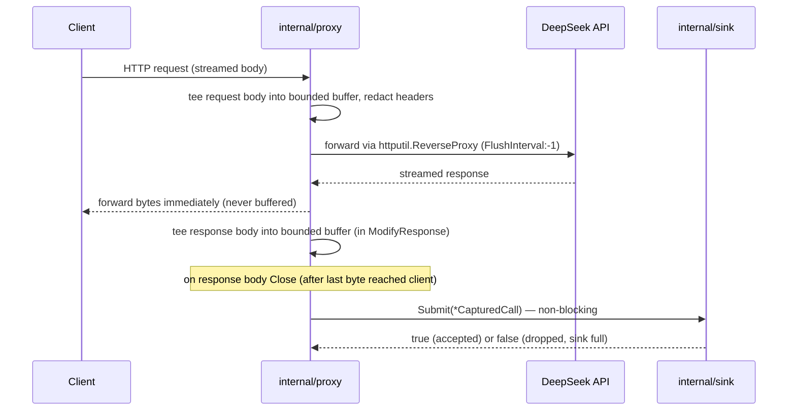
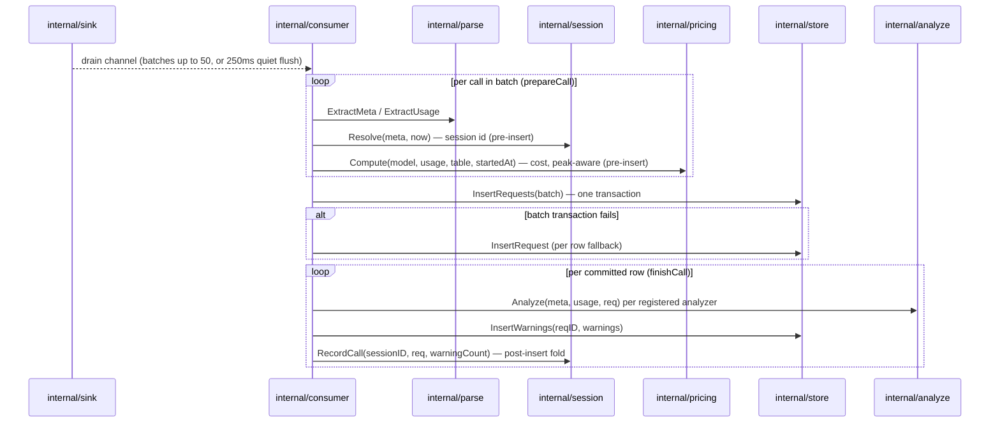
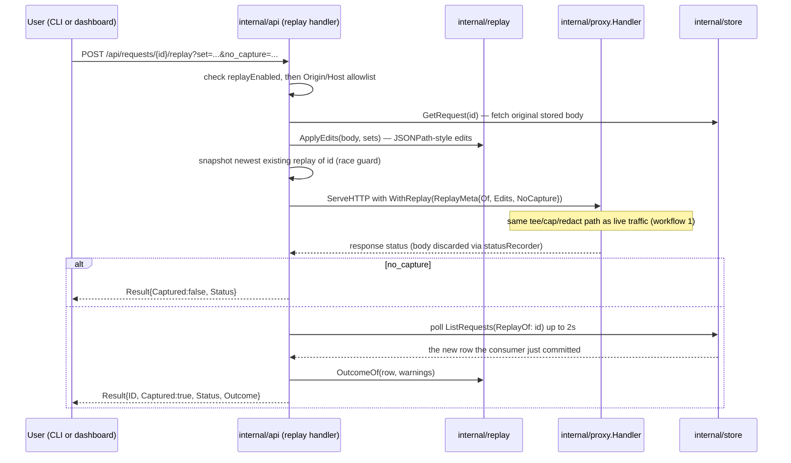

[← INDEX](INDEX.md)

# Workflows

### 1. Live traffic capture (the hot path)

Entry point: any HTTP request to the proxy listener (`lens serve`'s `ProxyAddr`, default
`127.0.0.1:8787`).

**Failure modes / idempotency**: `Submit` never blocks — under load it drops the call rather than
delaying the client ([internal/sink/sink.go:67-88](../../internal/sink/sink.go)). Upstream errors are
passed through faithfully as 502 and still submitted via `ErrorHandler`
([internal/proxy/proxy.go:48-55](../../internal/proxy/proxy.go)). This path never imports `store` or
`analyze` — see [CLAUDE.md](../../CLAUDE.md)'s "data flow is strictly one-way" invariant, protected by
the TTFB test
([internal/proxy/proxy_test.go:139](../../internal/proxy/proxy_test.go), `TestNoBufferingSSE`).

### 2. Cold-path capture → row (the consumer)

Entry point: `Consumer.Run`'s single goroutine, started by `lens serve`
([internal/cli/serve.go:111-115](../../internal/cli/serve.go)).

**Failure modes / idempotency**: every stage recovers its own panics — a bad body, a failing store
write, or a panicking analyzer is logged once, counted in `Stats.Failed`, and the loop moves on
([internal/consumer/consumer.go:1-14](../../internal/consumer/consumer.go)). This is deliberate:
"if Run ever returns early because of a single call's failure, capture silently stops for the rest
of the process — the worst failure mode in the project." Shutdown is bounded to 2s
(`shutdownBound`) so `Ctrl-C` never hangs; losing the last few in-flight calls is acceptable
([internal/consumer/consumer.go:55-62](../../internal/consumer/consumer.go)).

### 3. Session resolution

Runs as part of workflow 2's pre-insert step
([internal/session/session.go:66-111](../../internal/session/session.go)):

1. An explicit `x-lens-session` request header always wins, verbatim.
2. Otherwise, the most recently active session with the same prompt-prefix hash, if its `last_seen`
   is within the configured inactivity gap (`SessionGapMinutes`, default 30) — else a fresh session
   is minted.
3. A call whose body didn't parse (empty prefix hash) uses a much shorter 5-minute window (the
   "null-prefix bucket"), to avoid unrelated broken requests accumulating in one ever-growing group.

> ⚠️ ASSUMPTION (documented in code, not a gap): this is a heuristic, not exact correlation — two
> distinct runs with an identical opening prompt within the gap window merge into one session; a
> single run that pauses longer than the gap splits into two. The `x-lens-session` header is the
> exact-correlation escape hatch. See
> [internal/session/session.go:12-28](../../internal/session/session.go).

### 4. Replay

Entry point: either `lens replay <id>` (CLI) or a browser POST to `/api/requests/{id}/replay`.

**Failure modes / idempotency**: the Origin/Host guard runs before any store or upstream access, so
a rejected request costs nothing (see
[internal/api/api.go:491-542](../../internal/api/api.go) and
[security-and-permissions.md](security-and-permissions.md)). The row-appearance poll is a bounded
wait (`replayWait` = 2s, `replayPollInterval` = 25ms) rather than a completion hook on the consumer —
explicitly marked `ponytail:` as a deliberate simplification
([internal/api/api.go:458-469](../../internal/api/api.go)). A replayed request's stored headers carry
the redaction placeholder, not a real credential — lens never persists or injects an API key
(design invariant restated at [internal/api/api.go:380-384](../../internal/api/api.go)).
